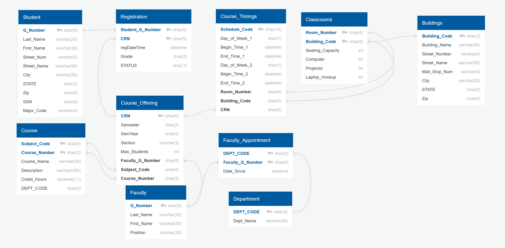

# Course Registration Database System

This project implements a relational database system for a fictional university course registration platform. It supports student enrollment, course offerings, scheduling, and faculty assignments using SQL Server.

## Project Structure

- Course_Registration_Project.sql – Main SQL file to create all tables, primary/foreign keys, and constraints.
- Course_Registration_Bulk_Insert_Script.sql – Loads sample data into tables using `BULK INSERT`.
- Course_Registration_Csv_Files – Folder containing CSV files for mock data input.
- Course_Registration_Diagram.png – ERD diagram visualizing the full schema and relationships.

## Key Features

- Fully normalized schema with support for:
  - Students, Faculty, Departments
  - Course and Section offerings
  - Time-based scheduling
  - Classroom and building assignments
- Composite and foreign keys for data integrity
- Constraints for registration limits and conflicts
- Multiple triggers and stored procedures (optional extension)

## How to Use

1. Open SQL Server Management Studio (SSMS).
2. Run Course_Registration_Project.sql to create the database schema.
3. Update file paths in Course_Registration_Bulk_Insert_Script.sql to match your local directory.
4. Run the insert script to populate data from Course_Registration_Csv_Files/.

>Note: Update all BULK INSERT paths to your local absolute paths (e.g., `C:\\Users\\YourName\\Desktop\\...`)

## Entity Relationship Diagram

## Technologies Used

- Microsoft SQL Server
- T-SQL (DDL, DML)
- CSV data loading via BULK INSERT

## Acknowledgments

This project was developed as a group assignment for an academic course. All members of the team contributed to the schema design, SQL scripting.

## License

This project is for educational use. No real data is included.

